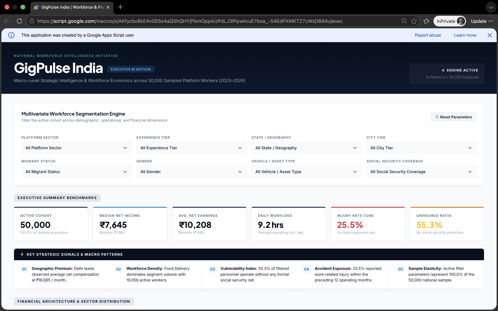
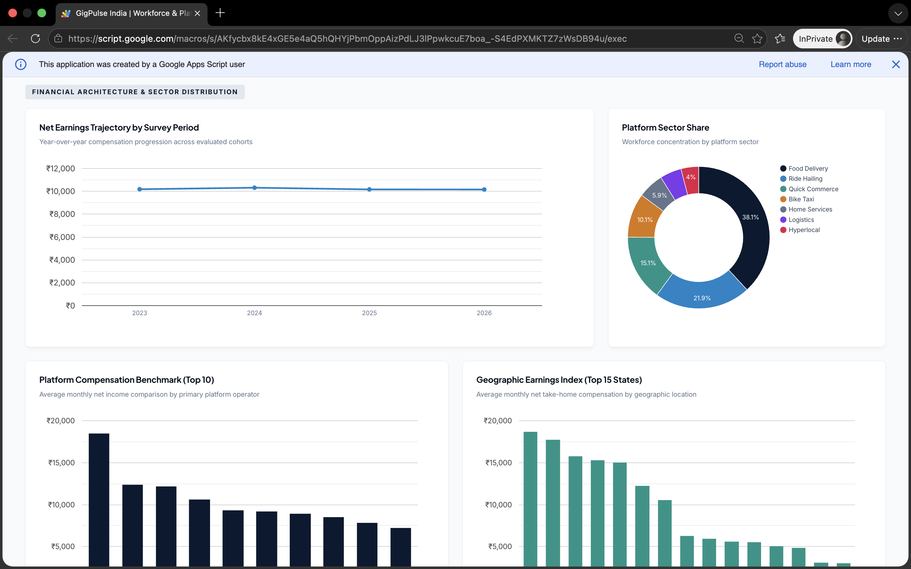
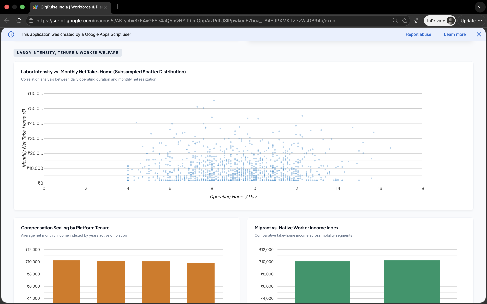
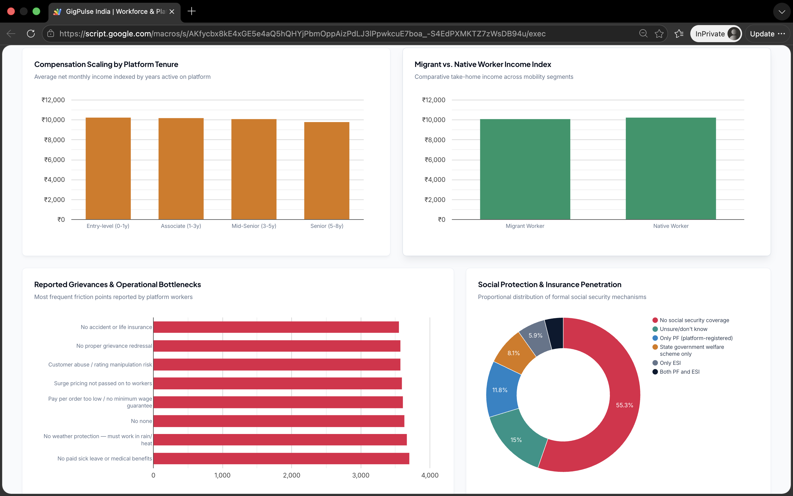

<div align="center">

<br/>

<h1>GigPulse India</h1>

<p>Interactive Workforce BI Dashboard — Indian Gig Economy Intelligence</p>

<br/>

[](#)
[](#)
[](#)
[](#)
[](#)

<br/>

> A free, lightweight, interactive Business Intelligence web app built entirely on **Google Workspace** — transforming raw survey data of **50,000 Indian gig economy workers** into an executive-ready dashboard with sub-5ms filtering, KPI metrics, 10+ interactive charts, and AI-generated insights.

<br/>

---

### 🔴 [→ Open Live Dashboard ←](https://script.google.com/macros/s/AKfycbx8kE4xGE5e4aQ5hQHYjPbmOppAizPdLJ3lPpwkcuE7boa_-S4EdPXMKTZ7zWsDB94u/exec)

**Click to explore 50,000 gig workers — live, filtered, interactive.**

💡 *If you see a Google Drive error, open in an incognito / private window — it will load correctly.*

---

```
No servers. No costs. No raw data exposure. Just insight.
```

<br/>

</div>

---

## ⚡ Performance at a Glance

<div align="center">

| Metric | Result | How |
|:---:|:---:|:---:|
| 📦 **Dataset** | **50,000 workers · 15 dimensions** | Serialized compact vector payloads |
| ⚡ **Filter Response** | **Sub-5ms** | In-memory client-side JS loop |
| 🚀 **Initial Load** | **< 2 seconds** | 6-hour CacheService layer |
| 🎨 **Chart Rendering** | **60 FPS** | 1,000-point scatter subsampling |
| 💸 **Server Cost** | **$0.00** | 100% serverless on Google |

</div>

---

## 💡 Why a Web App Instead of a Standard Sheet?

```
┌─────────────────────────────────────────────────────────────────────────┐
│                        DESIGN DECISIONS                                 │
├──────────────────────────────┬──────────────────────────────────────────┤
│  💸  100% Free & Hosted      │  Runs inside the browser via Google      │
│                              │  Apps Script — zero server costs          │
├──────────────────────────────┼──────────────────────────────────────────┤
│  🔒  Data Security           │  End-users interact with the dashboard   │
│                              │  URL — raw Sheet data stays hidden        │
├──────────────────────────────┼──────────────────────────────────────────┤
│  📱  Mobile-Friendly UI      │  Bootstrap 5 — clean on laptops,         │
│                              │  tablets, and smartphones                 │
├──────────────────────────────┼──────────────────────────────────────────┤
│  ⚡  Instant Filtering       │  Slice across 8 dimensions with zero     │
│                              │  server roundtrips — sub-5ms response    │
└──────────────────────────────┴──────────────────────────────────────────┘
```

---

## 📊 Dashboard Highlights

**Executive KPI Cards — Live, Filter-Responsive**

| KPI | Value (All Workers) |
|:---|:---:|
| Active Cohort Size | 50,000 |
| Median Net Take-Home | ₹7,645 |
| Avg. Net Earnings | ₹10,208 |
| Daily Operating Hours | 9.2 hrs |
| 12-Month Injury Rate | 25.5% |
| Uninsured Ratio | 55.3% |

**8-Dimension Filter Console**

| Filter | Options |
|:---|:---|
| Platform Sector | Food Delivery · Ride Hailing · Logistics · Quick Commerce · Home Services · Bike Taxi · Hyperlocal |
| Experience Tier | Entry (0–1y) · Associate (1–3y) · Mid-Senior (3–5y) · Senior (5–8y) · Veteran (8y+) |
| State | 17 Indian states & union territories |
| City Tier | T1 · T2 · T3 |
| Migrant Status | Migrant Worker · Native Worker |
| Gender | Male · Female |
| Vehicle Type | Motorcycle · Car · Auto · Scooter · E-bike · Mini truck |
| Social Security | No coverage · Platform PF · ESI · Both PF & ESI · State Welfare |

**AI Insights Banner**
Dynamically generated takeaways based on active filters — top-earning states, dominant sectors, vulnerability ratios, and segment patterns. Example from full dataset:

```
01  Geographic Premium: Delhi leads at ₹18,685 / month avg net compensation
02  Workforce Density: Food Delivery dominates with 19,059 active workers
03  Vulnerability Index: 55.3% operate without any formal social security net
04  Accident Exposure: 25.5% reported work-related injury in last 12 months
05  Sample Elasticity: Active filters represent 100.0% of the 50,000 sample
```

---

## 📸 Dashboard Preview

### 01 — Executive KPIs & Filter Console
> 8-dimension segmentation engine, 6 live KPI cards (50,000 cohort · ₹7,645 median income · 9.2 hrs daily · 25.5% injury rate · 55.3% uninsured), and AI-driven macro signals feed.



---

### 02 — Financial Architecture & Sector Distribution
> Net earnings trajectory (2023–2026), platform sector share donut (Food Delivery 38.1%), platform compensation benchmark (Top 10), and geographic earnings index (Top 15 states).



---

### 03 — Labor Intensity & Tenure Economics
> Daily operating hours vs. monthly take-home scatter (1,000-point subsampled, 60 FPS), compensation scaling by platform tenure (Entry → Senior), and migrant vs. native worker income index.



---

### 04 — Vulnerability & Social Protection Analysis
> Reported grievances ranking (no insurance · no grievance redress · rating manipulation), social security penetration donut (55.3% no coverage), compensation tenure bars, and migrant income comparison.



---

### Raw Data Source
> The underlying Google Sheet (`india_gig_economy_platform_workers_v2`) — end-users never see this; they only interact with the dashboard URL.


---

## 🏗️ Architecture

```
┌─────────────────────────────────────────────────────────────┐
│                      GOOGLE SHEET                           │
│      raw_data tab · 50,000 rows · 41 raw columns            │
└──────────────────────────┬──────────────────────────────────┘
                           │  6-hour CacheService layer
                           ▼
┌─────────────────────────────────────────────────────────────┐
│                    Code.gs (Backend)                        │
│   Ingest · Normalize · Vectorize 15 Core Dimensions         │
└──────────────────────────┬──────────────────────────────────┘
                           │  compact vector payload
                           ▼
┌─────────────────────────────────────────────────────────────┐
│                  JavaScript.html (Client)                   │
│   50k vectors loaded into browser memory on startup         │
│   8-dimension filter loop · Sub-5ms recomputation           │
│   Scatter subsampling engine · Google Charts API            │
└──────────┬────────────────────────────────────┬────────────┘
           │                                    │
           ▼                                    ▼
┌──────────────────────┐            ┌───────────────────────┐
│     Index.html       │            │       css.html        │
│  Navbar · Filters    │            │  KPI Cards · Layout   │
│  KPI Tiles · Charts  │            │  Gradients · Responsive│
└──────────────────────┘            └───────────────────────┘
```

**4 modular files — no framework overhead:**

| File | Role |
|:---|:---|
| `Code.gs` | Server-side — ingests, normalizes, vectorizes 15 dimensions from 41 raw columns |
| `Index.html` | Main layout — navbar, 8-filter console, KPI tiles, chart containers |
| `JavaScript.html` | Client-side — in-memory filter engine and Google Charts rendering |
| `css.html` | Styling — KPI cards, gradients, responsive layout rules |

---

## 🚀 4-Step Setup

**Step 1 — Prepare Your Google Sheet**

Import `india_gig_economy_platform_workers_v2.csv`. Confirm header row contains: `worker_id`, `survey_year`, `platform_type`, `state`, `city_tier`, `monthly_net_income_inr` etc.

**Step 2 — Open Google Apps Script**

In Google Sheets → `Extensions` → `Apps Script`. Rename project to `GigPulse-Analytics-Engine`.

**Step 3 — Create the 4 Files**

Inside Apps Script editor, create 4 files matching the repository source:
- `Code.gs` — replace the default code
- `Index.html` — click `+` → HTML → name it `Index`
- `JavaScript.html` — click `+` → HTML → name it `JavaScript`
- `css.html` — click `+` → HTML → name it `css`

Save all files (`Ctrl+S` / `Cmd+S`).

**Step 4 — Deploy**

`Deploy` → `New deployment` → gear icon → `Web app`

```
Execute as     →  Me (your email)
Who has access →  Anyone
```

Click **Deploy** → authorize permissions → open your live URL.

---

## 🤖 Built with Gemini AI

This project was built using **Google Gemini** as an AI co-pilot — each module was prompted, reviewed, and refined iteratively. All generated code was validated and tested against the live 50,000-record dataset before deployment.

**Key prompts used:**

```
Backend & Cache:
"Vectorize 15 core dimensions out of 41 raw columns to minimize payload
sizes. Back with a 6-hour chunked CacheService layer for sub-2-second
boot times."

Client-Side Filter Engine:
"Write an in-memory vector scanning loop that executes across 50,000
records in sub-5ms upon any filter change — no server roundtrips."

Chart Performance:
"Implement intelligent subsampling for dense scatter plots to ensure
smooth 60 FPS rendering without browser canvas freezing."
```

> All generated code was independently reviewed, tested, and validated before deployment.

---

## 💻 Tech Stack

```
┌──────────────────────────────────────────────────────────────┐
│                     GIGPULSE TECH STACK                      │
├──────────────────────┬───────────────────────────────────────┤
│  Backend Runtime     │  Google Apps Script (V8 Engine)       │
│  Frontend            │  Vanilla JS · Bootstrap 5.3.3         │
│  Visualizations      │  Google Charts API                    │
│  AI Insights         │  Google Gemini                        │
│  Data Source         │  Google Sheets (50,000 rows, 41 cols) │
│  Cache Layer         │  Google CacheService (6-hour TTL)     │
│  Hosting             │  Google Apps Script Web App (free)    │
└──────────────────────┴───────────────────────────────────────┘
```

---

<div align="center">

*GigPulse India — Built on Google. Powered by Gemini. Free to deploy.*

<br/>

[](#)

</div>
