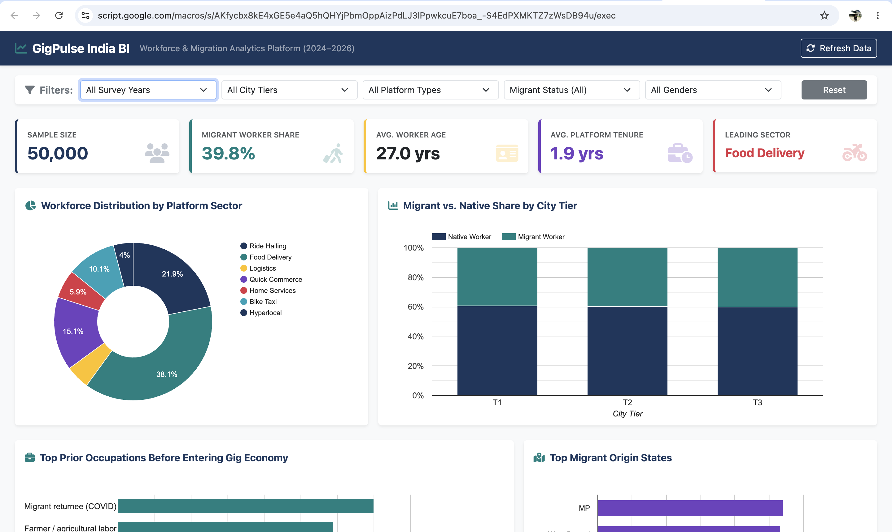
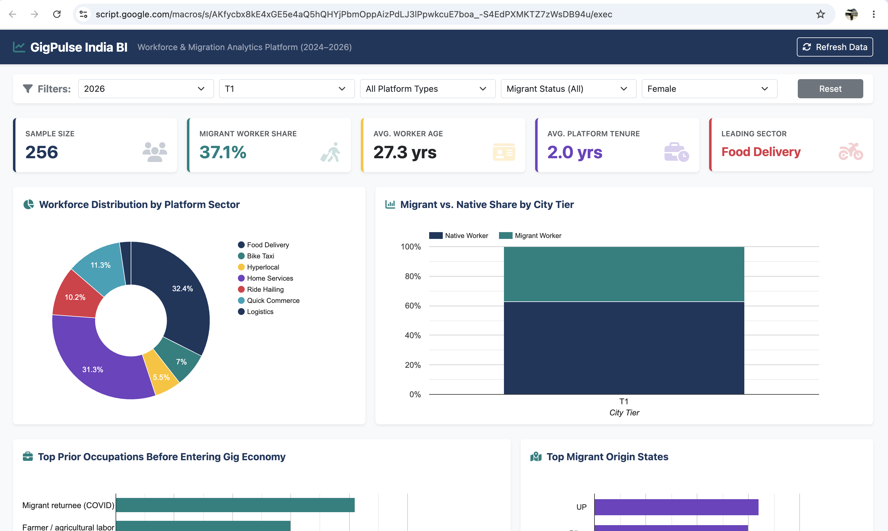
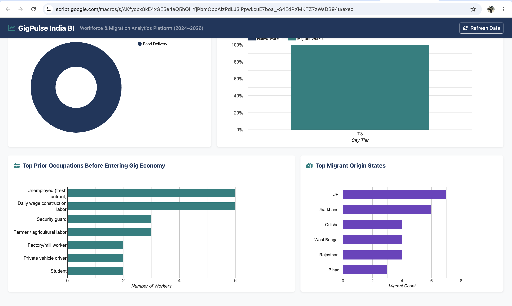
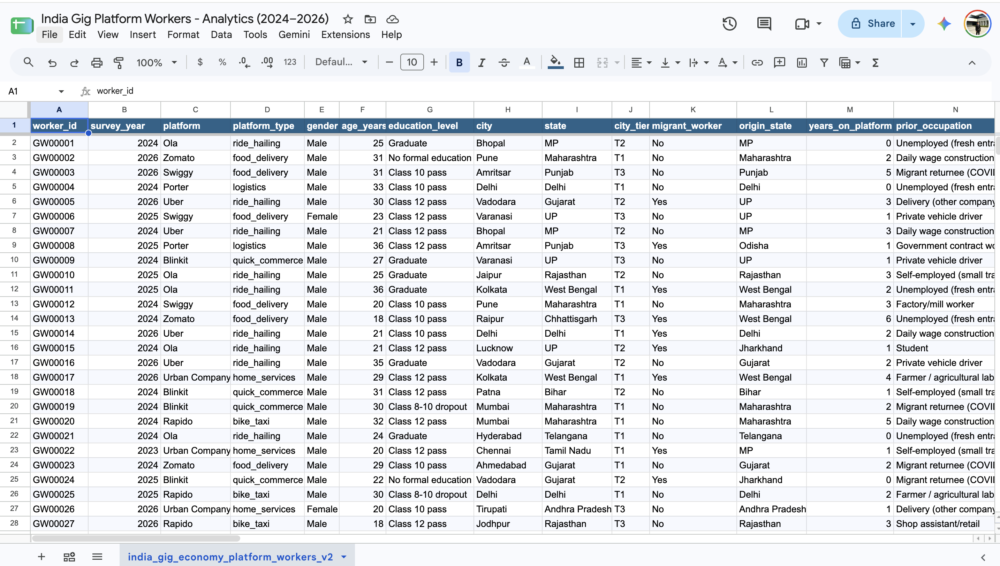

<div align="center">

<br/>

<h1>GigPulse India</h1>

<p>Interactive Workforce BI Dashboard — Indian Gig Economy Intelligence</p>

<br/>

[](#)
[](#)
[](#)
[](#)
[](#)

<br/>

> A free, lightweight, interactive Business Intelligence web app built entirely on **Google Workspace** — transforming raw survey data of **50,000 Indian gig economy workers** into an executive-ready dashboard with live filters, KPI metrics, interactive charts, and AI-generated insights.

<br/>

---

<div align="center">

### 🔴 [→ Open Live Dashboard ←](https://script.google.com/macros/s/AKfycbx8kE4xGE5e4aQ5hQHYjPbmOppAizPdLJ3lPpwkcuE7boa_-S4EdPXMKTZ7zWsDB94u/exec)

**Click to explore 50,000 gig workers — live, filtered, interactive.**

💡 *If you see a Google Drive error, open in an incognito / private window — it will load correctly.*

</div>

---

<br/>

```
No servers. No costs. No raw data exposure. Just insight.
```

<br/>

---

</div>

## 💡 Why a Web App Instead of a Standard Sheet?

```
┌─────────────────────────────────────────────────────────────────────────┐
│                        DESIGN DECISIONS                                 │
├──────────────────────────────┬──────────────────────────────────────────┤
│  💸  100% Free & Hosted      │  Runs inside the browser via Google      │
│                              │  Apps Script — zero server costs          │
├──────────────────────────────┼──────────────────────────────────────────┤
│  🔒  Data Security           │  End-users interact with the dashboard   │
│                              │  URL — raw Sheet data stays hidden        │
├──────────────────────────────┼──────────────────────────────────────────┤
│  📱  Mobile-Friendly UI      │  Bootstrap 5 — clean on laptops,         │
│                              │  tablets, and smartphones                 │
├──────────────────────────────┼──────────────────────────────────────────┤
│  ⚡  Instant Filtering       │  Slice by Year, City Tier, Platform,     │
│                              │  Gender, Migrant Status — no reloads     │
└──────────────────────────────┴──────────────────────────────────────────┘
```

---

## 📸 Dashboard Preview

### Full Dashboard — All Filters Reset
> 50,000 workers · 39.8% migrant share · 27.0 yrs avg age · Food Delivery leading sector — the complete unfiltered view across all city tiers.



---

### Filters Active — 2026 · T1 · Female
> 256 workers in segment · 37.1% migrant share · Food Delivery leading — KPI cards and all 4 charts updating live to the selected filter combination.



---

### Filter in Action — T3 City Tier
> Filtered to Tier 3 cities — charts redraw instantly showing T3-specific workforce distribution, migrant origin states, and prior occupations.



---

### Raw Data Source
> The underlying Google Sheet (`india_gig_economy_platform_workers_v2`) — end-users never see this; they only interact with the dashboard URL.



---

**Executive KPI Cards**
Real-time count of total workers, migrant ratio, average age, platform tenure, and leading sector — updating instantly with every filter change.

**Gemini AI Insights Banner**
Auto-generates concise summary takeaways based on your active filter selection. The dashboard doesn't just show data — it tells you what it means.

**Interactive Charts**

| Chart | Type | What It Shows |
|:---|:---|:---|
| Workforce Distribution | Donut | Ride Hailing · Food Delivery · Quick Commerce · more |
| Migrant vs. Native | Stacked Column | Worker origin split by City Tier (T1, T2, T3) |
| Prior Occupations | Horizontal Bar | Top roles workers held before gig work |
| Origin States | Horizontal Bar | Where migrant workers are coming from |

---

## 🏗️ Architecture

```
┌─────────────────────────────────────────────────────────────┐
│                      GOOGLE SHEET                           │
│              raw_data tab · 2,500+ rows                     │
└──────────────────────────┬──────────────────────────────────┘
                           │
                           ▼
┌─────────────────────────────────────────────────────────────┐
│                    Code.gs (Backend)                        │
│   getData() · Fetch · Clean · Normalize · Return JSON       │
└──────────────────────────┬──────────────────────────────────┘
                           │
                           ▼
┌─────────────────────────────────────────────────────────────┐
│                  JavaScript.html (Client)                   │
│   Filter Logic · Google Charts API · Dynamic Redraws        │
└──────────┬────────────────────────────────────┬────────────┘
           │                                    │
           ▼                                    ▼
┌──────────────────────┐            ┌───────────────────────┐
│     Index.html       │            │       css.html        │
│  Navbar · Filters    │            │  KPI Cards · Layout   │
│  KPI Tiles · Charts  │            │  Gradients · Responsive│
└──────────────────────┘            └───────────────────────┘
```

**4 modular files — no framework overhead:**

| File | Role |
|:---|:---|
| `Code.gs` | Server-side — fetches, cleans, and normalizes Sheet data into JSON |
| `Index.html` | Main layout — navbar, filters, KPI tiles, chart containers |
| `JavaScript.html` | Client-side — filter actions and Google Charts rendering logic |
| `css.html` | Styling — KPI cards, gradients, responsive layout rules |

---

## 🚀 4-Step Setup

<br/>

**Step 1 — Prepare Your Google Sheet**

Open your dataset. Rename the data tab to `raw_data`. Make sure row 1 has header names — `worker_id`, `survey_year`, `platform`, `city_tier`, `migrant_worker`.

**Step 2 — Open Google Apps Script**

In Google Sheets → `Extensions` → `Apps Script`. Rename the project to `GigPulse-Analytics-Engine`.

**Step 3 — Create the 4 Files**

Inside the Apps Script editor, create 4 files matching the code in this repository:
- `Code.gs` — replace the default code
- `Index.html` — click `+` → HTML → name it `Index`
- `JavaScript.html` — click `+` → HTML → name it `JavaScript`
- `css.html` — click `+` → HTML → name it `css`

Save all files (`Ctrl+S` / `Cmd+S`).

**Step 4 — Deploy**

`Deploy` → `New deployment` → gear icon → `Web app`

```
Description    →  GigPulse Dashboard v1
Execute as     →  Me (your email)
Who has access →  Anyone
```

Click **Deploy** → authorize permissions → open your live URL.

---

## 🤖 Built with Gemini AI

This project was engineered using **Google Gemini Canvas Mode** as an AI co-pilot — prompting, reviewing, and refining each module iteratively.

Key prompts used:

```
Backend:
"Act as a Google Apps Script expert. Write a getData() function in
Code.gs that reads rows from 'raw_data', cleans numbers/booleans,
validates required columns, and returns a clean JSON array."

Frontend:
"Build a dashboard UI using Bootstrap 5 and Google Charts API across
Index.html, JavaScript.html, and css.html. Include top filter dropdowns
for Year, Tier, Sector, Gender, and Migrant Status that redraw 4
charts dynamically."
```

> All generated code was reviewed, tested, and validated before deployment.

---

## 💻 Tech Stack

```
┌──────────────────────────────────────────────────────────────┐
│                     GIGPULSE TECH STACK                      │
├──────────────────────┬───────────────────────────────────────┤
│  Backend             │  Google Apps Script                   │
│  Frontend            │  Bootstrap 5, Google Charts API       │
│  AI Insights         │  Google Gemini                        │
│  Data Source         │  Google Sheets (raw_data tab)         │
│  Hosting             │  Google Apps Script Web App (free)    │
└──────────────────────┴───────────────────────────────────────┘
```

---

<div align="center">

*GigPulse India — Built on Google. Powered by Gemini. Free to deploy.*

<br/>

[](#)

</div>
